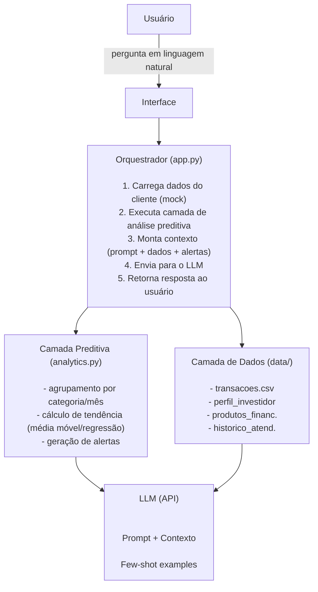

# 01. Documentação do Agente — Caso de Uso e Arquitetura

## 1. Visão Geral

**Nome do agente:** BIA Preditiva (Bradesco Inteligência Artificial — Preditiva)

**Resumo:** Assistente financeiro conversacional que vai além de responder perguntas sobre saldo, produtos e histórico de transações. A BIA Preditiva analisa o comportamento financeiro do cliente para **antecipar tendências de gastos**, alertar sobre desvios de padrão e recomendar produtos financeiros de forma contextualizada — transformando um chatbot reativo em um copiloto financeiro proativo.

## 2. Problema

Assistentes financeiros tradicionais respondem apenas ao que é perguntado ("qual meu saldo?", "quais produtos vocês têm?"). Isso desperdiça o maior ativo que um banco tem sobre o cliente: o **histórico de transações**. O cliente só descobre que gastou demais numa categoria quando já é tarde, e só conhece um produto financeiro quando ele mesmo pergunta por um.

## 3. Objetivo do Agente

Dado o histórico de transações e o perfil de investidor de um cliente, o agente deve:

1. Responder dúvidas sobre transações, produtos e atendimentos anteriores (caso base do lab);
2. Identificar tendências e padrões de gasto por categoria ao longo do tempo;
3. Projetar, de forma simples, o comportamento financeiro do próximo período;
4. Alertar o cliente quando um padrão relevante for identificado (ex: alta de gastos, sobra de caixa projetada);
5. Recomendar, de forma contextual e não intrusiva, produtos financeiros compatíveis com o perfil e o momento identificado.

## 4. Público-alvo

Clientes de varejo do banco que já possuem conta e histórico de transações, com diferentes perfis de investidor (conservador, moderado, arrojado), buscando entender melhor seus próprios hábitos financeiros.

## 5. Casos de Uso

| # | Caso de uso | Exemplo de pergunta do usuário |
|---|---|---|
| 1 | Consulta de transações | "Quanto eu gastei com alimentação em julho?" |
| 2 | Consulta de perfil | "Qual é o meu perfil de investidor?" |
| 3 | Consulta de produtos | "Quais produtos vocês têm para quem é conservador?" |
| 4 | Análise de tendência | "Meus gastos estão aumentando ou diminuindo?" |
| 5 | Projeção | "Como devo terminar o mês em relação a gastos?" |
| 6 | Alerta proativo | Agente identifica alta de gastos numa categoria e avisa espontaneamente no início da conversa |
| 7 | Recomendação contextual | Após identificar sobra de caixa projetada, sugere um produto de investimento compatível com o perfil |

## 6. Fora de Escopo

- Realizar transações reais (transferências, pagamentos, investimentos);
- Acessar dados de outros clientes;
- Dar recomendação de investimento como consultoria financeira formal (o agente **sugere**, não prescreve);
- Prever eventos macroeconômicos ou dar recomendações fora do escopo financeiro pessoal do cliente.

## 7. Arquitetura da Solução

## 8. Fluxo de Dados

1. O usuário faz uma pergunta na interface;
2. O orquestrador carrega os dados mockados do cliente selecionado;
3. A camada preditiva processa `transacoes.csv` e gera métricas (gasto por categoria, variação percentual mês a mês, projeção simples);
4. Essas métricas são injetadas como contexto adicional no prompt enviado ao LLM, junto com o perfil do investidor e o catálogo de produtos;
5. O LLM gera a resposta em linguagem natural, já incorporando os insights preditivos quando relevante;
6. A resposta é exibida ao usuário na interface.

